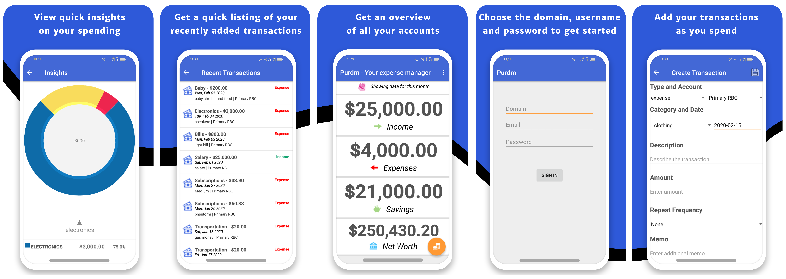

# PURDM ANDROID

This is the companion mobile app for PURDM the open source expenses manager.
You can learn more about PURDM [here](https://github.com/wyntonfranklin/wfexpenses).

PURDM for android allows you to track your expenses on the go.
The app is available on the playstore [here](https://play.google.com/store/apps/details?id=com.purdm.app&hl=en).

# Development

This app is built using java. You can clone the repo and get started at your leisure.
You can download android studio from [here](https://developer.android.com/studio).

